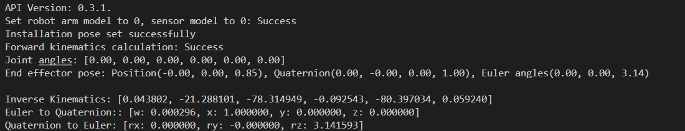

# 算法示例

## 1. 项目介绍

本项目演示了不连接机械臂，独立使用算法进行全型号机械臂在指定工作工具坐标系、指定安装角度下的正逆解，以及常用算法功能使用，如欧拉角转四元数、四元数转欧拉角等。项目基于Cmake构建，使用了睿尔曼提供的机械臂C语言开发包。

## 2. 代码结构

```
RMDemo_AlgoInterface
├── build              # CMake构建生成的输出目录（如Makefile、构建文件等）
├── include              # 自定义头文件存放目录
├── Robotic_Arm          睿尔曼机械臂二次开发包
│   ├── include
│   │   ├── rm_define.h     # 机械臂二次开发包头文件，包含了定义的数据类型、结构体
│   │   └── rm_interface.h  # 机械臂二次开发包头文件，声明了机械臂所有操作接口
│   └── lib
│       ├── api_c.dll    # Windows 64bit 的 API 库
│       ├── api_c.lib    # Windows 64bit 的 API 库
│       └── libapi_c.so  # Linux x86 的 API 库
├── src
│   └── main.c           # 主要功能的源文件
├── CMakeLists.txt       # 项目的顶层CMake配置文件
├── readme.md            # 项目说明文档
├── run.bat              # Windows快速运行脚本
└── run.sh               # linux快速运行脚本

```
## 3. 项目下载

通过链接下载 `RM_API2` 到本地：[开发包下载](https://github.com/RealManRobot/RM_API2.git)，进入`RM_API2\Demo\RMDemo_C`目录，可找到RMDemo_AlgoInterface。

## 4. 环境配置

在Windows和Linux环境下运行时需要的环境和依赖项：
| 项目 | Linux | Windows |
| :-- | :-- | :-- |
| 系统架构 | x86架构 | - |
| 编译器 | GCC 7.5或更高版本 | MSVC2015或更高版本 64bit |
| CMake版本 | 3.10或更高版本 | 3.10或更高版本 |
| 特定依赖 | RMAPI Linux版本库（位于`Robotic_Arm/lib`目录） | RMAPI Windows版本库（位于`Robotic_Arm/lib`目录） |

### Linux环境配置

**1. 编译器（GCC）**
在大多数Linux发行版中，GCC是默认安装的，但可能版本不是最新的。如果需要安装特定版本的GCC（如7.5或更高版本），可以使用包管理器进行安装。以Ubuntu为例，可以使用以下命令安装或更新GCC：

```bash
# 检查GCC版本
gcc --version

sudo apt update
sudo apt install gcc-7 g++-7  
```

注意：如果系统默认安装的GCC版本已满足或高于要求，则无需进行额外安装。

**2. CMake**
CMake在大多数Linux发行版中也可以通过包管理器安装。以Ubuntu为例：

```bash
sudo apt update
sudo apt install cmake

# 检查CMake版本
cmake --version
```

### Windows环境配置

**1. 编译器（MSVC2015或更高版本）**
MSVC（Microsoft Visual C++）编译器通常随Visual Studio一起安装。可以按照以下步骤安装：

1. 访问[Visual Studio官网](https://visualstudio.microsoft.com/)下载并安装Visual Studio。
2. 在安装过程中，选择“使用C++的桌面开发”工作负载，这将包括MSVC编译器。
3. 根据需要选择其他组件，如CMake（如果尚未安装）。
4. 完成安装后，打开Visual Studio命令提示符（可在开始菜单中找到），输入`cl`命令检查MSVC编译器是否安装成功。

**2. CMake**
如果Visual Studio安装过程中未包含CMake，可以单独下载并安装CMake。

1. 访问[CMake官网](https://cmake.org/download/)下载适用于Windows的安装程序。
2. 运行安装程序，按照提示进行安装。
3. 安装完成后，将CMake的bin目录添加到系统的PATH环境变量中（通常在安装过程中会询问是否添加）。
4. 打开命令提示符或PowerShell，输入`cmake --version`检查CMake是否安装成功。

## 5. 使用指南

### **5.1 快速运行**

**1. Linux运行**
在终端进入 `RMDemo_AlgoInterface` 目录，输入以下命令运行C程序：

```bash
chmod +x run.sh
./run.sh
```

运行结果如下：



**2. Windows运行**
进入 `RMDemo_AlgoInterface` 目录，双击运行run.bat文件。

运行结果如下：

```bash
Run...
API Version: 1.0.0.
Set robot arm model to 0, sensor model to 0: Success
Installation pose set successfully
Forward kinematics calculation: Success
Joint angles: [0.00, 0.00, 0.00, 0.00, 0.00, 0.00]
End effector pose: Position(-0.00, 0.00, 0.85), Quaternion(0.00, -0.00, 0.00, 1.00), Euler angles(0.00, 0.00, 3.14)

Inverse Kinematics: [0.043802, -21.288101, -78.314949, -0.092543, -80.397034, 0.059240]
Euler to Quaternion:: [w: 0.000296, x: 1.000000, y: 0.000000, z: 0.000000]
Quaternion to Euler: [rx: 0.000000, ry: -0.000000, rz: 3.141593]
请按任意键继续. . .
```

### **5.2 关键代码说明**

下面是 `main.c` 文件的主要功能：
- **定义各型号机械臂参数**

  各型号机械臂初始化参数数组

  ```c
  ArmModelData arm_data[9] = {
    [RM_MODEL_RM_65_E] = {
        .joint_angles = {0.0f, 0.0f, 0.0f, 0.0f, 0.0f, 0.0f},
        .q_in_joint = {0.0f, 0.0f, 0.0f, 0.0f, 0.0f, 0.0f},
        .pose = { .position = {0.3, 0, 0.3}, .euler = {3.14, 0, 0} }
    },
    [RM_MODEL_RM_75_E] = {
        .joint_angles = {0.0f, 0.0f, 0.0f, 0.0f, 0.0f, 0.0f},  
        .q_in_joint = {0.0f, 0.0f, 0.0f, 0.0f, 0.0f, 0.0f},
        .pose = { .position = {0.3, 0, 0.3}, .euler = {3.14, 0, 3.14} } 
    }, 
    [RM_MODEL_RM_63_II_E] = {  
        .joint_angles = {0.0f, 0.0f, 0.0f, 0.0f, 0.0f, 0.0f},  
        .q_in_joint = {0.0f, 0.0f, 0.0f, 0.0f, 0.0f, 0.0f},
        .pose = { .position = {0.3, 0, 0.3}, .euler = {3.14, 0, 0} }
    },
    [RM_MODEL_ECO_65_E] = {  
        .joint_angles = {0.0f, 0.0f, 0.0f, 0.0f, 0.0f, 0.0f},  
        .q_in_joint = {0.0f, 0.0f, 0.0f, 0.0f, 0.0f, 0.0f}, 
        .pose = { .position = {0.3, 0, 0.3}, .euler = {3.14, 0, 0} } 
    },
    [RM_MODEL_GEN_72_E] = {  
        .joint_angles = {0.0f, 0.0f, 0.0f, 0.0f, 0.0f, 0.0f, 0.0f},  
        .q_in_joint = {0.0f, 0.0f, 0.0f, 0.0f, 0.0f, 0.0f, 0.0f},  
        .pose = { .position = {0.3, 0, 0.3}, .euler = {3.14, 0, 0} } 
    },
    [RM_MODEL_ECO_63_E] = {  
        .joint_angles = {0.0f, 0.0f, 0.0f, 0.0f, 0.0f, 0.0f},  
        .q_in_joint = {0.0f, 0.0f, 0.0f, 0.0f, 0.0f, 0.0f},  
        .pose = { .position = {0.3, 0, 0.3}, .euler = {3.14, 0, 0} }
    }
  };
  ```

- **初始化算法接口**

  初始化机械臂型号RM65-B。

  ```c
  rm_robot_arm_model_e Mode = RM_MODEL_RM_65_E;
  rm_force_type_e Type = RM_MODEL_RM_B_E;
  printf("Set robot arm model to %d, sensor model to %d: Success\n", Mode, Type);
  rm_algo_init_sys_data(Mode, Type);
  ```

- **手动设置工作坐标系**
  实现设置指定的工作坐标系用于算法计算，坐标系位姿为 `[0, 0, 0, 0, 0, 0]`。
  
  ```C
  rm_frame_t coord_work;
  coord_work.pose.position.x = 0.0f;
  coord_work.pose.position.y = 0.0f;
  coord_work.pose.position.z = 0.0f;
  coord_work.pose.quaternion.w = 0.0f;
  coord_work.pose.quaternion.x = 0.0f;
  coord_work.pose.quaternion.y = 0.0f;
  coord_work.pose.quaternion.z = 0.0f;
  coord_work.pose.euler.rx = 0.0f;
  coord_work.pose.euler.ry = 0.0f;
  coord_work.pose.euler.rz = 0.0f;
  coord_work.payload = 0.0f;
  rm_algo_set_workframe(&coord_work);
  ```
  
- **逆解函数**
  实现从上一时刻关节角度`inverse_params.q_in` 到目标位姿 `inverse_params.q_pose` 的逆解，得到逆解结果`result`以及目标关节角度 `q_out`。其中目标位姿 `inverse_params.q_pose` 姿态使用欧拉角表示。
  
  ```C
  rm_inverse_kinematics_params_t inverse_params;
  float q_out[ARM_DOF] = {0.0f, 0.0f, 0.0f, 0.0f, 0.0f, 0.0f, 0.0f};
  memcpy(inverse_params.q_in, arm_data[Mode].q_in_joint, sizeof(arm_data[Mode].q_in_joint));
  inverse_params.q_pose = arm_data[Mode].pose;
  inverse_params.flag = 1;
  result = rm_algo_inverse_kinematics(NULL, inverse_params, q_out);
  ```

## 6. 许可证信息

- 本项目遵循MIT许可证。
