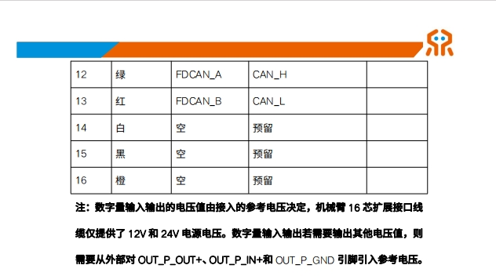
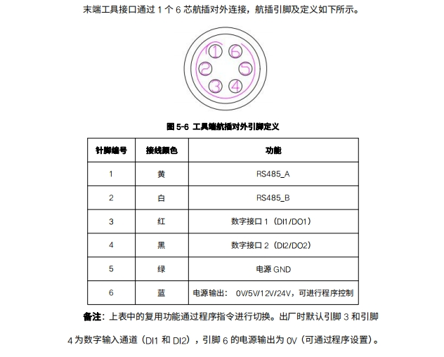

#  ModbusRTU模式使用示例

## **1. 项目介绍**

本项目演示如何配置RS485端口为ModbusRTU模式，并通过接口与连接的外设进行读写操作，示例操作流程如下：

完成配置通讯端口ModbusRTU模式、写单圈数据、读单圈数据、写单个寄存器、读保存寄存器、关闭通讯端口 Modbus RTU 模式。

项目基于Cmake构建，使用了睿尔曼提供的机械臂C语言开发包。

## **2. 代码结构**

```
RMDemo_ModbusRTU
├── build              # CMake构建生成的输出目录（如Makefile、构建文件等）
├── include              # 自定义头文件存放目录
├── Robotic_Arm          # 睿尔曼机械臂二次开发包
│   ├── include
│   │   ├── rm_define.h  # 机械臂二次开发包头文件，包含了定义的数据类型、结构体
│   │   └── rm_interface.h # 机械臂二次开发包头文件，声明了机械臂所有操作接口
│   └── lib
│       ├── api_c.dll    # Windows 64bit 的 API 库
│       ├── api_c.lib    # Windows 64bit 的 API 库
│       └── libapi_c.so  # Linux x86 的 API 库
├── src
│   └── main.c           # 主函数
├── CMakeLists.txt       # 项目的顶层CMake配置文件
├── readme.md            # 项目说明文档
├── run.bat              # Windows快速运行脚本
└── run.sh               # linux快速运行脚本
```

## **3.项目下载**

通过链接下载 `RM_API2` 到本地：[开发包下载](https://github.com/RealManRobot/RM_API2.git)，进入`RM_API2\Demo\RMDemo_C`目录，可找到RMDemo_ModbusRTU。

## **4. 环境配置**

在Windows和Linux环境下运行时需要的环境和依赖项：

| 项目      | Linux                                          | Windows                                          |
| :-------- | :--------------------------------------------- | :----------------------------------------------- |
| 系统架构  | x86架构                                        | -                                                |
| 编译器    | GCC 7.5或更高版本                              | MSVC2015或更高版本 64bit                         |
| CMake版本 | 3.10或更高版本                                 | 3.10或更高版本                                   |
| 特定依赖  | RMAPI Linux版本库（位于`Robotic_Arm/lib`目录） | RMAPI Windows版本库（位于`Robotic_Arm/lib`目录） |

### Linux环境配置

**1. 编译器（GCC）**
在大多数Linux发行版中，GCC是默认安装的，但可能版本不是最新的。如果需要安装特定版本的GCC（如7.5或更高版本），可以使用包管理器进行安装。以Ubuntu为例，可以使用以下命令安装或更新GCC：

```bash
# 检查GCC版本
gcc --version

sudo apt update
sudo apt install gcc-7 g++-7  
```

注意：如果系统默认安装的GCC版本已满足或高于要求，则无需进行额外安装。

**2. CMake**
CMake在大多数Linux发行版中也可以通过包管理器安装。以Ubuntu为例：

```bash
sudo apt update
sudo apt install cmake

# 检查CMake版本
cmake --version
```

### Windows环境配置

**1. 编译器（MSVC2015或更高版本）**
MSVC（Microsoft Visual C++）编译器通常随Visual Studio一起安装。可以按照以下步骤安装：

1. 访问[Visual Studio官网](https://visualstudio.microsoft.com/)下载并安装Visual Studio。
2. 在安装过程中，选择“使用C++的桌面开发”工作负载，这将包括MSVC编译器。
3. 根据需要选择其他组件，如CMake（如果尚未安装）。
4. 完成安装后，打开Visual Studio命令提示符（可在开始菜单中找到），输入`cl`命令检查MSVC编译器是否安装成功。

**2. CMake**
如果Visual Studio安装过程中未包含CMake，可以单独下载并安装CMake。

1. 访问[CMake官网](https://cmake.org/download/)下载适用于Windows的安装程序。
2. 运行安装程序，按照提示进行安装。
3. 安装完成后，将CMake的bin目录添加到系统的PATH环境变量中（通常在安装过程中会询问是否添加）。
4. 打开命令提示符或PowerShell，输入`cmake --version`检查CMake是否安装成功。

## **5. 使用指南**

### **5.1 快速运行**

按照以下步骤快速运行代码：

1. **配置机械臂IP地址**：
   打开 `main.c` 文件，在 `main` 函数中修改 `robot_ip_address` 参数为当前机械臂的IP地址，默认IP地址为 `"192.168.1.18"`。

   ```C
   const char *robot_ip_address = "192.168.1.18";

   int robot_port = 8080;
   rm_robot_handle *robot_handle = rm_create_robot_arm(robot_ip_address, robot_port);
   ```

2. **linux 命令行运行**：
   在终端进入 `RMDemo_ModbusRTU` 目录，输入以下命令运行C程序：

   ```bash
   chmod +x run.sh
   ./run.sh
   ```

   运行结果如下：

   参考 Windows 的运行结果。

3. **Windows 运行**： 双击run.bat脚本运行
   运行结果如下：

```bash
Run...
API Version: 1.0.0.
 send is: {"command":"get_arm_software_info"}


 thread_socket_receive len 315 robot_handle: 1 message:{"Product_version":"RM65-BI","algorithm_info":{"version":"1.4.4"},"command":"arm_software_info","ctrl_info":{"build_time":"2024/08/28 18:36:18","commit_id":"0315333","version":"V1.6.1"},"dynamic_info":{"model_version":"2"},"plan_info":{"build_time":"2024/08/28 18:36:33","commit_id":"166c4a8","version":"V1.6.1"}}

 [rm_get_arm_software_info] Product version: RM65-BI

 [rm_get_arm_software_info] Algorithm version: 1.4.4

 [rm_get_arm_software_info] Ctrl version: V1.6.1

 [rm_get_arm_software_info] Ctrl build Time: 2024/08/28 18:36:18

 [rm_get_arm_software_info] Dynamic model version: 2

 [rm_get_arm_software_info] Plan version: V1.6.1

 [rm_get_arm_software_info] Plan build Time: 2024/08/28 18:36:18

 send is: {"command":"get_realtime_push"}


 thread_socket_receive len 195 robot_handle: 1 message:{"command":"get_realtime_push","custom":{"expand_state":false,"joint_acc":false,"joint_speed":false,"lift_state":false,"tail_end":false},"cycle":5,"enable":true,"ip":"192.168.1.88","port":8089}

 [rm_get_realtime_push] cycle parse result: 5

 [rm_get_realtime_push] port parse result: 8089

 [rm_get_realtime_push] ip parse result: 192.168.1.88

 [rm_get_realtime_push] enable parse result: 1

 send is: {"command":"get_current_work_frame"}


 thread_socket_receive len 74 robot_handle: 1 message:{"frame_name":"World","pose":[0,0,0,0,0,0],"state":"current_work_frame"}

 [get_current_work_frame] Work frame Name: World

 [get_current_work_frame] Work frame pose: (0.000, 0.000, 0.000, 0.000, 0.000, 0.000)

 send is: {"command":"get_current_tool_frame"}


 thread_socket_receive len 106 robot_handle: 1 message:{"payload":0,"pose":[0,0,0,0,0,0],"position":[0,0,0],"state":"current_tool_frame","tool_name":"Arm_Tip"}

 [get_current_tool_frame] Tool frame Name: Arm_Tip

 [get_current_tool_frame] Tool frame pose: (0.000, 0.000, 0.000, 0.000, 0.000, 0.000)

 [get_current_tool_frame] Tool frame payloda: 0.000

 [get_current_tool_frame] Tool frame position: (0.000, 0.000, 0.000)

 send is: {"command":"get_install_pose"}


 thread_socket_receive len 41 robot_handle: 1 message:{"pose":[0,0,0],"state":"install_pose"}

 [rm_get_install_pose] pose parse result:

  0

  0

  0

 send is: {"command":"get_joint_min_pos"}


 thread_socket_receive len 87 robot_handle: 1 message:{"min_pos":[-178000,-130000,-135000,-178000,-128000,-360000],"state":"joint_min_pos"}

 [rm_get_joint_min_pos] min_pos parse result:

  -178000

  -130000

  -135000

  -178000

  -128000

  -360000

 send is: {"command":"get_joint_max_pos"}


 thread_socket_receive len 81 robot_handle: 1 message:{"max_pos":[178000,130000,135000,178000,128000,360000],"state":"joint_max_pos"}

 [rm_get_joint_max_pos] max_pos parse result:

  178000

  130000

  135000

  178000

  128000

  360000

 send is: {"command":"get_joint_max_acc"}


 thread_socket_receive len 83 robot_handle: 1 message:{"joint_acc":[100000,100000,100000,100000,100000,100000],"state":"joint_max_acc"}

 [rm_get_joint_max_acc] joint_acc parse result:

  100000

  100000

  100000

  100000

  100000

  100000

 send is: {"command":"get_joint_max_speed"}


 thread_socket_receive len 81 robot_handle: 1 message:{"joint_speed":[30000,30000,37500,37500,37500,37500],"state":"joint_max_speed"}

 [rm_get_joint_max_speed] joint_speed parse result:

  30000

  30000

  37500

  37500

  37500

  37500

Robot handle created successfully: 1
 send is: {"command":"set_modbus_mode","port":0,"baudrate":115200,"timeout":10}


 thread_socket_receive len 48 robot_handle: 1 message:{"command":"set_modbus_mode","set_state":true}

 [rm_set_modbus_mode] set_state: true

 send is: {"command":"write_single_coil","port":0,"address":0,"data":0,"device":2}


 thread_socket_receive len 52 robot_handle: 1 message:{"command":"write_single_coil","write_state":true}

 [rm_write_single_coil] write_state: true

 send is: {"command":"read_coils","port":0,"address":0,"num":1,"device":2}


 thread_socket_receive len 35 robot_handle: 1 message:{"command":"read_coils","data":0}

 [rm_read_coils] data parse result: 0

 send is: {"command":"write_single_coil","port":0,"address":0,"data":1,"device":2}


 thread_socket_receive len 52 robot_handle: 1 message:{"command":"write_single_coil","write_state":true}

 [rm_write_single_coil] write_state: true

 send is: {"command":"write_single_register","port":0,"address":0,"data":180,"device":2}


 thread_socket_receive len 56 robot_handle: 1 message:{"command":"write_single_register","write_state":true}

 [rm_write_single_register] write_state: true

 send is: {"command":"read_holding_registers","port":0,"address":0,"device":2}


 thread_socket_receive len 49 robot_handle: 1 message:{"command":"read_holding_registers","data":180}

 [rm_read_holding_registers] data parse result: 180

 send is: {"command":"close_modbus_mode","port":0}


 thread_socket_receive len 50 robot_handle: 1 message:{"command":"close_modbus_mode","set_state":true}

 [rm_close_modbus_mode] set_state: true

请按任意键继续...
```

### **5.2 关键代码说明**

下面是 `main.c` 文件的主要功能：

- **连接机械臂**

    ```C
    rm_robot_handle *robot_handle = rm_create_robot_arm(robot_ip_address, robot_port);
    ```

  连接到指定IP和端口的机械臂。

- **获取API版本**

    ```C
    char *api_version = rm_api_version();
    printf("API Version: %s.\n", api_version);
    ```

  获取并显示API版本。

- **配置Modbus RTU模式**

    ```C
    rm_set_modbus_mode(robot_handle, 0, 115200, 10);
    ```

- **写单圈数据**

    ```C
    rm_peripheral_read_write_params_t write_params = {0, 0, 2, 1};
    result = rm_write_single_coil(robot_handle, write_params, 1);
    ```

- **读单圈数据**

    ```C
    rm_peripheral_read_write_params_t read_params = {0, 0, 2, 1};
    int coil_data;
    result = rm_read_coils(robot_handle, read_params, &coil_data);
    ```

- **写单个寄存器**

    ```C
    rm_peripheral_read_write_params_t write_single_register_params = { 0, 0, 2, 1};
    result = rm_write_single_register(robot_handle, write_single_register_params, 180);
    if (check_result(result, "Failed to write single register") != 0) {
        return -1;
    }
    ```

- **读保存寄存器**

    ```C
    rm_peripheral_read_write_params_t holding_registers_params = {0, 0, 2, 1};
    int holding_register_data;
    result = rm_read_holding_registers(robot_handle, holding_registers_params, &holding_register_data);
    ```

- **关闭Modbus RTU模式**

    ```C
    rm_close_modbus_mode(robot_handle, 0);
    ```

- **断开机械臂连接**

    ```C
     rm_delete_robot_arm(robot_handle);
    ```

## **6. 许可证信息**

- 本项目遵循MIT许可证。

## 控制器和终端接口图

### 控制器 IO 接口图 1


### 控制器 IO 接口图 2


### 终端 IO 接口图


### 终端 IO 接口图


### 模拟ModRTU图


