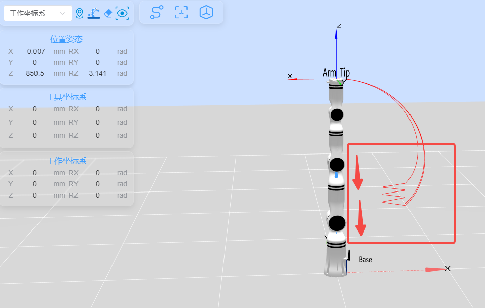

## **1. 项目介绍**
本项目是一个使用睿尔曼 C开发包完成工程完成机械臂连接、机械臂版本获取、API版本获取、movej运动、moveL运动、开始六维力力控movel直线运动，并在力控下轨迹向下，之后关闭力控断开连接。

## **2. 代码结构**
```
RMDemo_ForceControl/
├── build/                  # CMake构建生成的输出目录（如Makefile、构建文件等）
├── cmake/                  # CMake模块和脚本的存放目录
│   ├── FindMyLib.cmake     # 自定义的Find模块，用于查找外部库
├── data/
│   └── robot_log.txt          # 日志、轨迹文件等数据文件目录（在执行过程中生成）
├── include/                # 自定义头文件存放目录
├── Robotic_Arm/               睿尔曼机械臂二次开发包
│   ├── include/
│   │   ├── rm_define.h        # 机械臂的定义
│   │   └── rm_interface.h     # 机械臂 API 的接口头文件
│   └── lib/
│       ├── api_c.dll          # Windows 的 API 库
│       ├── api_c.lib          # Windows 的 API 库
│       └── libapi_c.so        # Linux 的 API 库
├── src/                     # 源文件存放目录
│   ├── main.c #             主要功能的源文件
├── run.bat                   # 快速运行脚本， Windows为bat脚本
├── run.sh                   # 快速运行脚本， linux为shell脚本
├── CMakeLists.txt           # 项目的顶层CMake配置文件
├── README.md                # 为示例工程提供详细的文档

```
## **3. 系统要求**

- 操作系统：Ubuntu 18.04或更高版本
- 编译器：GCC 7.5或更高版本 (或任何其他兼容的C编译器)
- 依赖库：
  - CMake 3.10或更高版本
  - RMAPI库(包含在 `Robotic_Arm/lib`目录中)

    
## **4. 安装说明**

1. 克隆项目到本地：

   ```bash

   ```

2. 构建项目：
   Linux下：
   cmake:
   ```bash
   mkdir build
   cd build
   cmake ..
   make
   
   ```
   
   如果是GC编译的话 ：
   ```bash
   #!/bin/bash
    # 编译并链接
    gcc -I./Robotic_Arm/include -L./Robotic_Arm/lib -Wl,-rpath=./Robotic_Arm/lib -o demo_force_control src/demo_force_control.c src/utils.c src/main.c -lapi_c

    
    # 检查编译是否成功
    if [ $? -eq 0 ]; then
    # 设置LD_LIBRARY_PATH环境变量
    export LD_LIBRARY_PATH=$LD_LIBRARY_PATH:./Robotic_Arm/lib
    
    # 运行编译后的可执行文件
    ./demo_force_control
    else
    echo "编译失败"
    fi
   ```


## **5. 注意事项**

该Demo以RM65-B型号机械臂为例，请根据实际情况修改代码中的数据。

## **6. 使用指南**

### **6.1. 快速运行**

按照以下步骤快速运行代码：

1. **配置机械臂IP地址**：打开 `demo_force_control.c` 文件，在 `main` 函数中修改 `robot_ip_address` 类的初始化参数为当前机械臂的IP地址，默认IP地址为 `"192.168.1.18"`。

    ```C
    const char *robot_ip_address = "192.168.1.18";
    int robot_port = 8080;
    rm_robot_handle *robot_handle = rm_create_robot_arm(robot_ip_address, robot_port);
    ```

2. **命令行运行**：在终端进入 `RMDemo_ForceControl` 目录，输入以下命令运行C程序：
   2.1 Linux下
* ```bash
    chmod +x run.sh
    ./run.sh
    ```

2.2  Windows下: 双击运行 run.bat


### **6.2. 代码说明**

下面是 `demo_force_control.c` 文件的主要功能：


- **连接机械臂**
    ```C
    rm_robot_handle *robot_handle = rm_create_robot_arm(robot_ip_address, robot_port);
    ```
  连接到指定IP和端口的机械臂。

- **获取API版本**

    ```C
    char *api_version = rm_api_version();
    printf("API Version: %s.\n", api_version);
    ```
  获取并显示API版本。

- **执行movej运动**

    ```C
    float joint_angles_start[6] = {0.0, 0.0, 0.0, 0.0, 0.0, 0.0};
    movej(robot_handle, joint_angles_start, 20, 0, 1, 1);
    ```

- **执行movej_p运动**

    ```C
    rm_pose_t start_pose = { {0.3, 0, 0.4},{0, 0, 0}, {3.141, 0, 0} };
    movej_p(robot_handle, start_pose, 20, 0, 1, 0);
    ```

- **启用力控制模式**

    ```C
    set_force_position(robot_handle, 1, 0, 2, -5);
    ```

- **执行movel运动**

    ```C
    movel(robot_handle, start_pose, 50, 0, 1, 0);
    ```

- **停止力控制模式**

    ```C
    stop_force_position(robot_handle);
    ```

- **断开机械臂连接**

    ```C
    disconnect_robot_arm(robot_handle);
    ```


### **6.3. 运行结果示例**

运行脚本后，输出结果如下所示：

```
INFO: rm_init: Operation successful
API Version: 0.3.0.
Robot handle created successfully: 1
Current arm_dof: 6
Successfully obtained the current state of the robot arm.
Pose: Position(0.299994, -0.000002, 0.307220), Quaternion(0.000296, 1.000000, 0.000000, 0.000000), Euler angles(3.141000
, 0.000000, 0.000000)
Joint angle array: [0.015000, -21.037001, -76.683998, -0.032000, -82.278000, 0.026000]
Robot arm error code: 0
Controller error code: 0
INFO: movej: Operation successful
INFO: movej_p: Operation successful
INFO: set_force_position: Operation successful
INFO: movel: Operation successful
INFO: movel: Operation successful
INFO: stop_force_position: Operation successful
INFO: set_force_position: Operation successful
INFO: movel: Operation successful
INFO: movel: Operation successful
INFO: stop_force_position: Operation successful
INFO: set_force_position: Operation successful
INFO: movel: Operation successful
INFO: movel: Operation successful
INFO: stop_force_position: Operation successful
INFO: disconnect_robot_arm: Operation successful
```
运行脚本后，运行轨迹从上至下如下图所示：




* **支持渠道**：

    + 开发者论坛/社区：[链接地址](https://bbs.realman-robotics.cn)
    + 

- API文档：详见`rm_interface.h`文件。


## **7. 许可证信息**

* 本项目遵循MIT许可证。

## **8. 常见问题解答（FAQ）**


- **Q:** 如何解决编译错误？
  **A:** 请确保您的编译器版本和依赖库满足系统要求，并按照安装说明重新配置环境。

- **Q:** 如何连接机器人？
  **A:** 请参考示例代码中的连接步骤，确保机器人IP地址和端口正确配置。

- **Q:** 如何获取更多帮助？
  **A:** 请在GitHub项目页面提交Issue或联系维护者。
