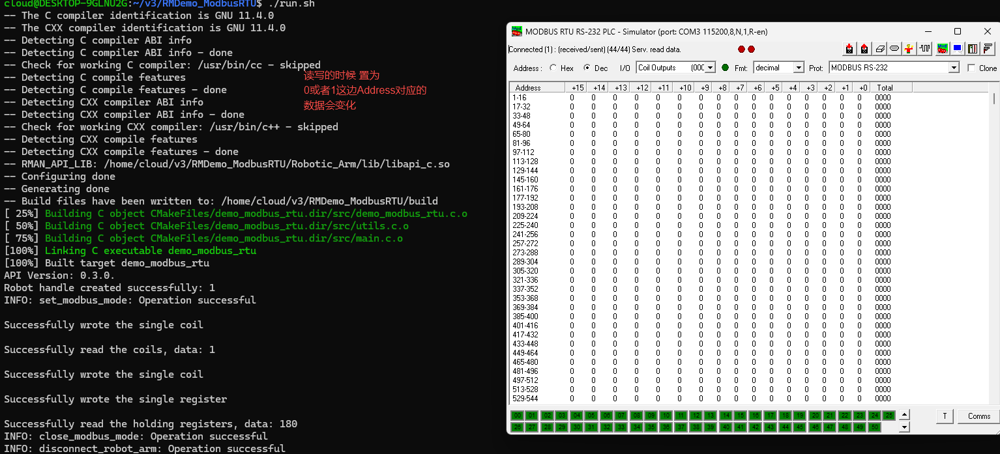

#  RMDemo_ModbusRTU

## **1. 项目介绍**
本项目是一个使用睿尔曼C开发包, 完成配置通讯端口ModbusRTU模式、写单圈数据、读单圈数据、写单个寄存器、读保存寄存器、关闭通讯端口 Modbus RTU 模式。


## **2. 代码结构**
```
RMDemo_ModbusRTU
├── build              # CMake构建生成的输出目录（如Makefile、构建文件等）
├── cmake              # CMake模块和脚本的存放目录
│   ├── ...
├── data
│   └── robot_log.txt    # 日志、轨迹文件等数据文件目录（在执行过程中生成）
├── include              # 自定义头文件存放目录
├── Robotic_Arm          睿尔曼机械臂二次开发包
│   ├── include
│   │   ├── rm_define.h  # 机械臂的定义
│   │   └── rm_interface.h # 机械臂 API 的接口头文件
│   ├── lib
│   │   ├── api_c.dll    # Windows 的 API 库
│   │   ├── api_c.lib    # Windows 的 API 库
│   │   └── libapi_c.so  # Linux 的 API 库
├── src
│   ├── main.c           # 主函数
├── CMakeLists.txt       # 项目的顶层CMake配置文件
├── readme.md            # 为示例工程提供详细的文档
├── run.bat              # 快速运行脚本， Windows为bat脚本
└── run.sh               # 快速运行脚本， linux为shell脚本

```

## **3. 系统要求**

- 操作系统：Ubuntu 18.04或更高版本
- 编译器：GCC 7.5或更高版本 (或任何其他兼容的C编译器)
- 依赖库：
  - CMake 3.10或更高版本
  - RMAPI库(包含在 `Robotic_Arm/lib`目录中)


## **4. 安装说明**

1. 克隆项目到本地：

   ```bash

   ```

2. 构建项目：
   Linux下：
   cmake:
   ```bash
   mkdir build
   cd build
   cmake ..
   make
   
   ```

   如果是GC编译的话 ：
   ```bash
   #!/bin/bash
    # 编译并链接
    
    gcc -I./Robotic_Arm/include -I./include -L./Robotic_Arm/lib -Wl,-rpath=./Robotic_Arm/lib -o RMDemo_ModbusRTU src/main.c -lapi_c

    # 检查编译是否成功
    if [ $? -eq 0 ]; then
    # 设置LD_LIBRARY_PATH环境变量
    export LD_LIBRARY_PATH=$LD_LIBRARY_PATH:./Robotic_Arm/lib
    
    # 运行编译后的可执行文件
    ./RMDemo_ModbusRTU
    else
    echo "编译失败"
    fi
   ```


## **5. 注意事项**

该Demo以RM65-B型号机械臂为例，请根据实际情况修改代码中的数据。

## **6. 使用指南**

### **6.1. 快速运行**

按照以下步骤快速运行代码：

1. **配置机械臂IP地址**：打开 `main.c` 文件，在 `main` 函数中修改 `robot_ip_address` 类的初始化参数为当前机械臂的IP地址，默认IP地址为 `"192.168.1.18"`。

    ```C
    const char *robot_ip_address = "192.168.1.18";
    int robot_port = 8080;
    rm_robot_handle *robot_handle = rm_create_robot_arm(robot_ip_address, robot_port);
    ```

2. **命令行运行**：在终端进入 `RMDemo_ModbusRTU` 目录，输入以下命令运行C程序：
   2.1 Linux下
* ```bash
    chmod +x run.sh
   ./run.sh
    ```

2.2  Windows下: 双击运行 run.bat


### **6.2. 代码说明**

下面是 `main.c` 文件的主要功能：

- **连接机械臂**

    ```C
    rm_robot_handle *robot_handle = rm_create_robot_arm(robot_ip_address, robot_port);
    ```
  连接到指定IP和端口的机械臂。

- **获取API版本**

    ```C
    char *api_version = rm_api_version();
    printf("API Version: %s.\n", api_version);
    ```
  获取并显示API版本。

- **配置Modbus RTU模式**

    ```C
    rm_set_modbus_mode(robot_handle, 0, 115200, 10);
    ```

- **写单圈数据**

    ```C
    rm_peripheral_read_write_params_t write_params = {0, 0, 2, 1};
    result = rm_write_single_coil(robot_handle, write_params, 1);
    ```

- **读单圈数据**

    ```C
    rm_peripheral_read_write_params_t read_params = {0, 0, 2, 1};
    int coil_data;
    result = rm_read_coils(robot_handle, read_params, &coil_data);
    ```

- **写单个寄存器**

    ```C
    rm_peripheral_read_write_params_t write_single_register_params = { 0, 0, 2, 1};
    result = rm_write_single_register(robot_handle, write_single_register_params, 180);
    if (check_result(result, "Failed to write single register") != 0) {
        return -1;
    }
    ```

- **读保存寄存器**

    ```C
    rm_peripheral_read_write_params_t holding_registers_params = {0, 0, 2, 1};
    int holding_register_data;
    result = rm_read_holding_registers(robot_handle, holding_registers_params, &holding_register_data);
    ```

- **关闭Modbus RTU模式**

    ```C
    rm_close_modbus_mode(robot_handle, 0);
    ```

- **断开机械臂连接**

    ```C
     rm_delete_robot_arm(robot_handle);
    ```

### **6.3. 运行结果示例**

运行脚本后，输出结果如下所示：
```

```


* **支持渠道**：

  + 开发者论坛/社区：[链接地址](https://bbs.realman-robotics.cn)
  +
- API文档：详见`rm_interface.h`文件。

- [Modbus-RTU 协议文档](http://www.modbus.org/specs.php)
- [Realman 机械臂用户手册](https://bbs.realman-robotics.cn/question/117.html)


## **6. 许可证信息**

* 本项目遵循MIT许可证。

## **7. 常见问题解答（FAQ）**


- **Q:** 如何解决编译错误？
  **A:** 请确保您的编译器版本和依赖库满足系统要求，并按照安装说明重新配置环境。

- **Q:** 如何连接机器人？
  **A:** 请参考示例代码中的连接步骤，确保机器人IP地址和端口正确配置。

- **Q:** 末端RS485没有连上的话？
  **A:** 确保连接的设备支持 Modbus-RTU 协议 确保机械臂正确连接到控制器，并使用 RS485 通信电缆将控制器连接到终端设备 将控制器的 RS485 端口连接到终端设备的 RS485 端口，确保通信线路正确连接。

  

## 控制器和终端接口图

### 控制器 IO 接口图 1


### 控制器 IO 接口图 2


### 终端 IO 接口图


### 终端 IO 接口图


### 模拟ModRTU图



