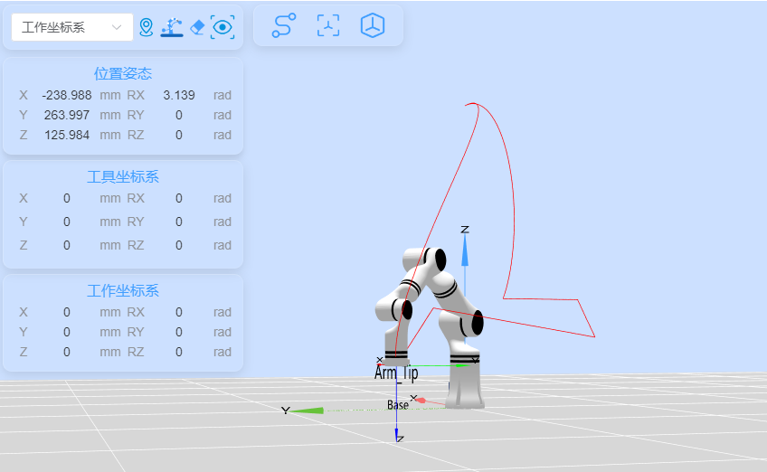

# RMDemo_Moves

## **1. 项目介绍**
本项目是一个使用睿尔曼C开发包, 演示了样条曲线运动的使用。该项目使用 CMake 构建，支持使用三个或更多点来演示样条曲线运动


## **2. 代码结构**
```
RMDemo_Moves
├── build              # CMake构建生成的输出目录（如Makefile、构建文件等）
├── cmake              # CMake模块和脚本的存放目录
│   ├── ...
├── data
│   └── robot_log.txt    # 日志、轨迹文件等数据文件目录（在执行过程中生成）
├── include              # 自定义头文件存放目录
├── Robotic_Arm          睿尔曼机械臂二次开发包
│   ├── include
│   │   ├── rm_define.h  # 机械臂的定义
│   │   └── rm_interface.h # 机械臂 API 的接口头文件
│   ├── lib
│   │   ├── api_c.dll    # Windows 的 API 库
│   │   ├── api_c.lib    # Windows 的 API 库
│   │   └── libapi_c.so  # Linux 的 API 库
├── src
│   ├── main.c           # 主函数
├── CMakeLists.txt       # 项目的顶层CMake配置文件
├── readme.md            # 为示例工程提供详细的文档
├── run.bat              # 快速运行脚本， Windows为bat脚本
└── run.sh               # 快速运行脚本， linux为shell脚本

```

## **3. 系统要求**

- 操作系统：Ubuntu 18.04或更高版本
- 编译器：GCC 7.5或更高版本 (或任何其他兼容的C编译器)
- 依赖库：
  - CMake 3.10或更高版本
  - RMAPI库(包含在 `Robotic_Arm/lib`目录中)


## **4. 安装说明**

1. 克隆项目到本地：

   ```bash

   ```

2. 构建项目：
   Linux下：
   cmake:
   ```bash
   mkdir build
   cd build
   cmake ..
   make
   
   ```

   如果是GC编译的话 ：
   ```bash
   #!/bin/bash
    # 编译并链接
    
    gcc -I./Robotic_Arm/include -I./include -L./Robotic_Arm/lib -Wl,-rpath=./Robotic_Arm/lib -o RMDemo_Moves src/main.c -lapi_c
   
    -I./Robotic_Arm/include：包含机器人臂头文件目录。
    -I./include：包含通用头文件目录。
    -L./Robotic_Arm/lib：指定库文件目录。
    -Wl,-rpath=./Robotic_Arm/lib：设置运行时库的搜索路径。
    -o RMDemo_Moves：指定输出可执行文件的名称。
    src/main.c：包含所有源文件。
    -lapi_c：链接 api_c 库。
    
    # 检查编译是否成功
    if [ $? -eq 0 ]; then
    # 设置LD_LIBRARY_PATH环境变量
    export LD_LIBRARY_PATH=$LD_LIBRARY_PATH:./Robotic_Arm/lib
    
    # 运行编译后的可执行文件
    ./RMDemo_Moves
    else
    echo "编译失败"
    fi
   ```


## **5. 注意事项**

1. 该Demo以RM65-B型号机械臂为例，请根据实际情况修改代码中的数据。
2. moves样条曲线运动，其中的轨迹连接标志最后一个为0，前面的均为1，如果都为0则为movel直线运动。

## **6. 使用指南**

### **6.1. 快速运行**

按照以下步骤快速运行代码：

1. **配置机械臂IP地址**：打开 `main.c` 文件，在 `main` 函数中修改 `robot_ip_address` 类的初始化参数为当前机械臂的IP地址，默认IP地址为 `"192.168.1.18"`。

    ```C
    const char *robot_ip_address = "192.168.1.18";
    int robot_port = 8080;
    rm_robot_handle *robot_handle = rm_create_robot_arm(robot_ip_address, robot_port);
    ```

2. **命令行运行**：在终端进入 `RMDemo_Moves` 目录，输入以下命令运行C程序：
   2.1 Linux下
* ```bash
    chmod +x run.sh
   ./run.sh
    ```

2.2  Windows下: 双击运行 run.bat


### **6.2. 代码说明**

下面是 `main.c` 文件的主要功能：
- **定义各型号机械臂参数数组**

  ```C
  ArmModelData arm_data[9] = {
    {
        {0, 20, 70, 0, 90, 0},  // joint_angles
        {{0.3, 0, 0.3}, {0,0,0,0},{3.14, 0, 0}},  // movej_pose1
        {{0.3, 0, 0.3}, {0,0,0,0},{3.14, 0, 0}},  // movel_pose
        {{0.3, 0, 0.3}, {0,0,0,0},{3.14, 0, 0}},  // movej_pose2
        {{0.2, 0.05, 0.3}, {0,0,0,0},{3.14, 0, 0}},  // movec_pose_via
        {{0.2, -0.05, 0.3}, {0,0,0,0},{3.14, 0, 0}}  // movec_pose_to
    },
    {
        {0, 20, 0, 70, 0, 90, 0},  
        { {0.297557, 0, 0.337061}, {0,0,0,0},{3.142, 0, 3.142} } ,
        { {0.097557, 0, 0.337061}, {0,0,0,0},{3.142, 0, 3.142} } ,
        { {0.297557, 0, 0.337061}, {0,0,0,0},{3.142, 0, 3.142} } ,
        { {0.257557, -0.08, 0.337061}, {0,0,0,0},{3.142, 0, 3.142} } ,
        { {0.257557, 0.08, 0.337061}, {0,0,0,0},{3.142, 0, 3.142} } 
    }, 
    {0},
    {  
        {0, 20, 70, 0, 90, 0},  
        { {0.448968,0, 0.345083}, {0,0,0,0},{3.142, 0, 3.142} },
        { {0.248968,0, 0.345083}, {0,0,0,0},{3.142, 0, 3.142} },
        { {0.448968,0, 0.345083}, {0,0,0,0},{3.142, 0, 3.142} },
        { {0.408968,-0.1, 0.345083}, {0,0,0,0},{3.142, 0, 3.142} },
        { {0.408968,0.1, 0.345083}, {0,0,0,0},{3.142, 0, 3.142} }
    },
    {0},
    {  
        {0, 20, 70, 0, -90, 0},  
        { {0.352925,-0.058880, 0.327320}, {0,0,0,0},{3.14, 0, -1.57} } ,
        { {0.152925,-0.058880, 0.327320}, {0,0,0,0},{3.14, 0, -1.57} } ,
        { {0.352925,-0.058880, 0.327320}, {0,0,0,0},{3.14, 0, -1.57} } ,
        { {0.302925,-0.158880, 0.327320}, {0,0,0,0},{3.14, 0, -1.57} } ,
        { {0.302925,0.058880, 0.327320}, {0,0,0,0},{3.14, 0, -1.57} } 
    },
    {
        0
    },
    {  
        {0, 0, 0, -90, 0, 0, 0},  
        { {0.1,0, 0.4}, {0,0,0,0},{3.14, 0, 0} } ,
        { {0.3,0, 0.4}, {0,0,0,0},{3.14, 0, 0} } ,
        { {0.3595,0, 0.4265}, {0,0,0,0},{3.14, 0, 0} } ,
        { {0.3595,0.03, 0.4265}, {0,0,0,0},{3.14, 0, 0} } ,
        { {0.3595,0.03, 0.4665}, {0,0,0,0},{3.14, 0, 0} } 
    },
    {  
        {0, 20, 70, 0, -90, 0},  
        { {0.544228,-0.058900, 0.468274}, {0,0,0,0},{3.14, 0, -1.571} },
        { {0.344228,-0.058900, 0.468274}, {0,0,0,0},{3.14, 0, -1.571} },
        { {0.544228,-0.058900, 0.468274}, {0,0,0,0},{3.14, 0, -1.571} },
        { {0.504228,-0.108900, 0.468274}, {0,0,0,0},{3.14, 0, -1.571} },
        { {0.504228,-0.008900, 0.468274}, {0,0,0,0},{3.14, 0, -1.571} }
    }
  };
  ```
- **连接机械臂**

    ```C
    rm_robot_handle *robot_handle = rm_create_robot_arm(robot_ip_address, robot_port);
    ```
  连接到指定IP和端口的机械臂。

- **获取API版本**

    ```C
    char *api_version = rm_api_version();
    printf("API Version: %s.\n", api_version);
    ```
  获取并显示API版本。


- **执行movej运动**

    ```C
    rm_movej(robot_handle, arm_data[arm_info.arm_model].joint_angles, 20, 0, 0, 1);
    ```

- **执行movej_p运动**

    ```C
    rm_movej_p(robot_handle, arm_data[arm_info.arm_model].movej_pose1, 20, 0, 0, 1);
    ```

- **执行moves运动**

    ```C
    execute_moves(robot_handle, arm_data[arm_info.arm_model].point_list, POINT_NUM, 20, 1);
    ```
  
- 执行moves运动，沿多点轨迹进行样条曲线移动。 轨迹如下图所示
- 

- 当 trajectory_connect 为 0时候 会如下：
-   
- 
- **断开机械臂连接**

    ```C
    disconnect_robot_arm(robot_handle);
    ```

### **6.3. 运行结果示例**

运行脚本后，输出结果如下所示：
```
API Version: 0.3.0.
Robot handle created successfully: 1
movej motion succeeded
INFO: movej: Operation successful
movej_p motion succeeded
INFO: movej_p: Operation successful
INFO: moves: Operation successful
moves motion succeeded
INFO: moves: Operation successful
moves motion succeeded
INFO: moves: Operation successful
moves motion succeeded
INFO: moves: Operation successful
moves motion succeeded
INFO: moves: Operation successful
moves motion succeeded
moves operation succeeded
INFO: get_robot_pose: Operation successful
Current robot pose: Position [-0.238786, 0.166277, 0.275834], Orientation [3.140000, -0.002000, 0.000000]
INFO: disconnect_robot_arm: Operation successful
```


* **支持渠道**：

  + 开发者论坛/社区：[链接地址](https://bbs.realman-robotics.cn)
  +

- API文档：详见`rm_interface.h`文件。


## **7. 许可证信息**

* 本项目遵循MIT许可证。

## **8. 常见问题解答（FAQ）**


- **Q:** 如何解决编译错误？
  **A:** 请确保您的编译器版本和依赖库满足系统要求，并按照安装说明重新配置环境。

- **Q:** 如何连接机器人？
  **A:** 请参考示例代码中的连接步骤，确保机器人IP地址和端口正确配置。

- **Q:** 样条曲线运动3个点以上？
  **A:** 对于样条曲线运动，最后一段轨迹的连接标志应为 0，而之前的应为 1。如果全部为 0，将进行线性运动。样条曲线运动需至少连续下发三个点位（trajectory_connect设置为1），否则运动轨迹为直线

- **Q:** libapi_c.so 未找到？
  **A:** 请参考示例代码 路径问题：确保所有路径（包括头文件目录和库文件目录）都是正确的。
  库文件问题：确保 libapi_c.so（在 Unix 系统上）或 api_c.dll（在 Windows 系统上）位于 ./Robotic_Arm/lib 目录下。
  权限问题：确保你有权限读取所有相关文件和目录。
