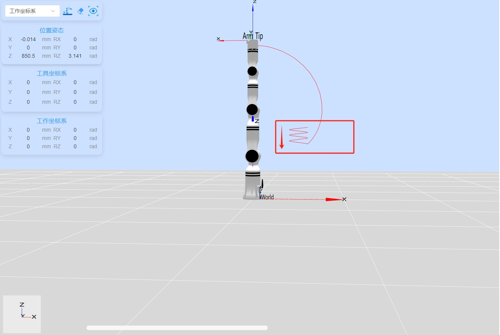

# 机械臂力控示例

## 1. 项目介绍

本项目是一个使用睿尔曼Python开发完成机械臂连接、机械臂版本获取、API版本获取、开始六维力力控movel直线运动，并在力控下轨迹向下，之后关闭力控断开连接。

## 2. 代码结构

```
RMDemo_ForceControl/
│
├── README.md        <- 项目的核心文档
├── requirements.txt    <- 项目的依赖列表
├── setup.py        <- 项目的安装脚本
│
├── src/          <- 项目的源代码
│  ├── main.py       <- 程序的主入口
│  └── core/        <- 核心功能或业务逻辑代码
│    └── demo_force_control.py      <- 完成机械臂连接、机械臂版本获取、API版本获取、开始六维力力控movel直线运动，并在力控下轨迹向下，之后关闭力控断开连接。
└── Robotic_Arm/      <- 睿尔曼机械臂二次开发包
```

## 3.项目下载

通过链接下载 `RM_API2` 到本地：[开发包下载](https://github.com/RealManRobot/RM_API2.git)，进入`RM_API2\Demo\RMDemo_Python`目录，可找到RMDemo_ForceControl。

## 4. 环境配置

在Windows和Linux环境下运行时需要的环境和依赖项：

| 项目         | Linux     | Windows   |
| :--          | :--       | :--       |
| 系统架构     | x86架构   | -         |
| python       | 3.9以上   | 3.9以上   |
| 特定依赖     | -         | -         |

### Linux环境配置

   1. 参考[python官网-linux](https://www.python.org/downloads/source/)下载安装python3.9。

   2. 进入项目目录后打开终端运行以下指令安装依赖：

```bash
pip install -r requirements.txt
```

### Windows环境配置

   1. 参考[python官网-Windows](https://www.python.org/downloads/windows/)下载安装python3.9。

   2. 进入项目目录后打开终端运行以下指令安装依赖：

```bash
pip install -r requirements.txt
```

## **5. 注意事项**

1. 该Demo需要机械臂有**六维力**才可以使用。

## 6. 使用指南

### 1. 快速运行

按照以下步骤快速运行代码：

1. **配置机械臂IP地址**：打开 `demo_force_control.py` 文件，在 `main` 函数中修改 `RobotArmController` 类的初始化参数为当前机械臂的IP地址，默认IP地址为 `"192.168.1.18"`。

    ```python
    # Create a robot arm controller instance and connect to the robot arm
    robot_controller = RobotArmController("192.168.1.18", 8080, 3)
    ```

2. **命令行运行**：在终端进入 `RMDemo_ForceControl` 目录，输入以下命令运行Python脚本：

    ```bash
    python ./src/main.py
    ```
   
3. **运行结果**：在终端中可以看到机械臂执行的结果。

    (1)运行脚本后，输出结果如下所示：

```
current api version:  0.2.9

Successfully connected to the robot arm: 1

API Version:  0.2.9 

movej motion succeeded

movej_p motion succeeded

Set force control mode succeeded

movel motion succeeded

movel motion succeeded

Stop force control mode succeeded
Set force control mode succeeded

movel motion succeeded

movel motion succeeded

Stop force control mode succeeded
Set force control mode succeeded

movel motion succeeded

movel motion succeeded

Stop force control mode succeeded

Successfully disconnected from the robot arm
```

   (2)运行脚本后，运行轨迹从上至下如下图所示：



### 2. 代码说明

下面是 `demo_force_control.py` 文件的主要功能：

- **连接机械臂**

    ```python
    robot_controller = RobotArmController("192.168.1.18", 8080, 3)
    ```

    连接到指定IP和端口的机械臂。

- **获取API版本**

    ```python
    print("\nAPI Version: ", rm_api_version(), "\n")
    ```

    获取并显示API版本。

- **执行movej运动**

    ```python
    robot_controller.movej([0, 0, 0, 0, 0, 0])
    ```

- **执行movej_p运动**

    ```python
    robot_controller.movej_p([0.3, 0, 0.4, 3.141, 0, 0])
    ```

- **启用力控制模式**

    ```python
    robot_controller.set_force_position(sensor=1, mode=0, direction=2, force=-5)
    ```

- **执行movel运动**

    ```python
    robot_controller.movel([0.2, 0, 0.4, 3.141, 0, 0], v=50)
    ```

- **停止力控制模式**

    ```python
    robot_controller.stop_force_position()
    ```

- **断开机械臂连接**

    ```python
    robot_controller.disconnect()
    ```


## 7. 许可证信息

- 本项目遵循MIT许可证。
