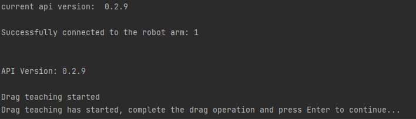

# 机械臂IO功能使用示例


## 1. 项目介绍

本项目是一个使用睿尔曼Python开发包实现拖动示教，将轨迹保存到文件夹下，并拼接为在线编程文件，再保存至在线编程列表，设置为默认IO运行编程文件，通过IO复用模式运行、暂停、继续、急停在线编程。

## 2. 代码结构

```
RMDemo_IOControl/
│
├── README.md        <- 项目的核心文档
├── requirements.txt    <- 项目的依赖列表
├── setup.py        <- 项目的安装脚本
│
├── src/          <- 项目的源代码
│  ├── main.py       <- 程序的主入口
│  └── core/        <- 核心功能或业务逻辑代码
│    └── demo_io_control.py     <- 实现拖动示教，将轨迹保存到文件夹下，并拼接为在线编程文件，再保存至在线编程列表，设置为默认IO运行编程文件，通过IO复用模式运行、暂停、继续、急停在线编程。
└── Robotic_Arm/      <- 睿尔曼机械臂二次开发包
```

## 3.项目下载

通过链接下载 `RM_API2` 到本地：[开发包下载](https://github.com/RealManRobot/RM_API2.git)，进入`RM_API2\Demo\RMDemo_Python`目录，可找到RMDemo_IOControl。

## 4. 环境配置

在Windows和Linux环境下运行时需要的环境和依赖项：

| 项目         | Linux     | Windows   |
| :--          | :--       | :--       |
| 系统架构     | x86架构   | -         |
| python       | 3.9以上   | 3.9以上   |
| 特定依赖     | -         | -         |

### Linux环境配置

   1. 参考[python官网-linux](https://www.python.org/downloads/source/)下载安装python3.9。

   2. 进入项目目录后打开终端运行以下指令安装依赖：

```bash
pip install -r requirements.txt
```

### Windows环境配置

   1. 参考[python官网-Windows](https://www.python.org/downloads/windows/)下载安装python3.9。

   2. 进入项目目录后打开终端运行以下指令安装依赖：

```bash
pip install -r requirements.txt
```

## 5. 使用指南

### 5.1 快速运行

1. **参数配置**
   
   打开`demo_algo_interface.py` 文件，在main函数中可修改以下配置：
   
   - 配置要连接的机械臂IP地址（默认为`"192.168.1.18"`）：如果用户修改过机械臂的IP，修改`RobotArmController`类的初始化参数为机械臂当前IP。
   - 配置文件保存至在线编程列表的id号（默认为100）：通过`test_id`参数修改文件保存至在线编程时的id。请检查在线编程列表，必要时修改该id号以确保在您的在线编程列表中该id为可用的。
   - 配置控制器IO复用功能（默认设置为	IO1：表示开始运行在线编程文件、IO2：表示暂停运行在线编程文件、IO3：表示继续运行在线编程文件、IO4：表示急停功能）：通过`set_io_mode`方法修改每个IO端口的复用模式。
   
2. **命令行运行**

   在终端进入`RMDemo_IOControl`目录，输入以下命令运行Python脚本：

```
python ./src/main.py
```

3. **拖动机械臂进行示教**

   当终端打印出以下信息，机械臂已进入拖动示教模式，用户可以拖动机械臂完成需要的轨迹，拖动完成后按下回车键退出拖动示教模式并保存轨迹到data文件夹下的trajectory.txt文件中。

   

4. **通过IO复用模式控制该轨迹文件的运行、暂停、继续、急停**

   程序运行结束后，拖动示教保存的轨迹文件已经保存到指定id的在线编程程序列表，并且设置为IO 默认运行的在线编程文件。此时，控制器IO设置为：

   ​	IO1：表示开始运行在线编程文件；

   ​	IO2：表示暂停运行在线编程文件；

   ​	IO3：表示继续运行在线编程文件；
   
   ​	IO4：表示急停功能；
   
   IO为高电平触发，参考 `9. 控制器和末端接口图` 完成IO接线后，即可通过对应IO端口高电平实现相应的IO功能。

5. **运行结果**

运行脚本后，输出结果如下所示：

```
Successfully connected to the robot arm: 1

API Version:  0.3.0 

Drag teaching started
Drag teaching has started, complete the drag operation and press Enter to continue...
Drag teaching stopped
Trajectory saved successfully, total number of points: 100
Project send successfully but not run, data length verification failed
Set default running program successfully: Program ID 100
IO mode set successfully: IO number 1
IO mode set successfully: IO number 2
IO mode set successfully: IO number 3
IO mode set successfully: IO number 4
Successfully disconnected from the robot arm
```

#### 6.2 代码说明
下面是 `demo_io_control.py` 文件的主要功能：

- **拖动示教**

    ```python
    robot_controller.drag_teach(1)
    ```
    开始拖动示教并记录轨迹。

- **保存轨迹**

    ```python
    lines = robot_controller.save_trajectory(file_path_test)
    ```
    将记录的轨迹保存到文件。

- **添加文件头信息**

    ```python
    robot_controller.add_lines_to_file(file_path_test, 6, lines)
    ```
    将指定信息添加到轨迹文件中。

- **发送项目文件**

    ```python
    robot_controller.send_project(file_path_test, only_save=1, save_id=test_id)
    ```
    将项目文件发送到机械臂。

- **设置默认运行程序**

    ```python
    robot_controller.set_default_run_program(test_id)
    ```
    设置默认的在线编程文件。

- **设置IO模式**

    ```python
    robot_controller.set_io_mode(1, 2)  # Set IO mode to input start function multiplexing mode
    robot_controller.set_io_mode(2, 3)  # Set IO mode to input pause function multiplexing mode
    robot_controller.set_io_mode(3, 4)  # Set IO mode to input continue function multiplexing mode
    robot_controller.set_io_mode(4, 5)  # Set IO mode to input emergency stop function multiplexing mode
    ```
    设置IO端口的模式。

- **设置数字IO输出状态**

    ```python
    robot_controller.set_do_state(io_num, io_state)
    ```
    设置数字IO端口的输出状态。

- **获取数字IO输入状态**

    ```python
    robot_controller.get_io_input(io_num)
    ```
    获取数字IO端口的输入状态。

## 6. 许可证信息

- 本项目遵循MIT许可证。

## 7. 控制器和末端接口图

### 控制器IO接口图1


### 控制器IO接口图2


### 末端IO接口图

