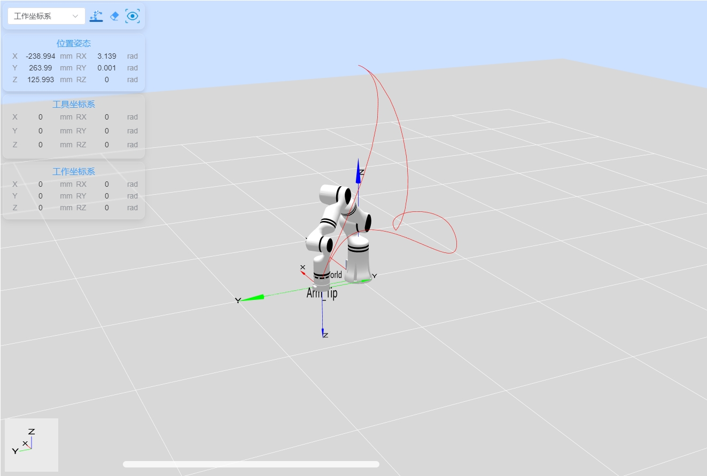

# 样条曲线运动示例

## 1. 项目介绍

本项目是一个使用睿尔曼Python开发包完成工程完成机械臂连接、机械臂版本获取、API版本获取、moveS运动关闭连接。

## 2. 代码结构

```
RMDemo_Moves/
│
├── README.md        <- 项目的核心文档
├── requirements.txt    <- 项目的依赖列表
├── setup.py        <- 项目的安装脚本
│
├── src/          <- 项目的源代码
│  ├── main.py       <- 程序的主入口
│  └── core/        <- 核心功能或业务逻辑代码
│    └── demo_moves.py      <- 完成机械臂连接、机械臂版本获取、API版本获取、movej运动、moveL运动、moveC运动、关闭连接的示例。
└── Robotic_Arm/      <- 睿尔曼机械臂二次开发包
```

## 3.项目下载

通过链接下载 `RM_API2` 到本地：[开发包下载](https://github.com/RealManRobot/RM_API2.git)，进入`RM_API2\Demo\RMDemo_Python`目录，可找到RMDemo_Moves。

## 4. 环境配置

在Windows和Linux环境下运行时需要的环境和依赖项：

| 项目         | Linux     | Windows   |
| :--          | :--       | :--       |
| 系统架构     | x86架构   | -         |
| python       | 3.9以上   | 3.9以上   |
| 特定依赖     | -         | -         |

### Linux环境配置

   1. 参考[python官网-linux](https://www.python.org/downloads/source/)下载安装python3.9。

   2. 进入项目目录后打开终端运行以下指令安装依赖：

```bash
pip install -r requirements.txt
```

### Windows环境配置

   1. 参考[python官网-Windows](https://www.python.org/downloads/windows/)下载安装python3.9。

   2. 进入项目目录后打开终端运行以下指令安装依赖：

```bash
pip install -r requirements.txt
```

## 5. 注意事项

1. 该Demo以RM65-B型号机械臂为例，请根据实际情况修改代码中的数据。
2. moves样条曲线运动，其中的轨迹连接标志最后一个为0，前面的均为1，如果都为0则为movel直线运动。

## 6. 使用指南

### 1. 快速运行

按照以下步骤快速运行代码：

1. **配置机械臂IP地址**：打开 `demo_moves.py` 文件，在 `main` 函数中修改 `RobotArmController` 类的初始化参数为当前机械臂的IP地址，默认IP地址为 `"192.168.1.18"`。

    ```python
    # Create a robot arm controller instance and connect to the robot arm
    robot_controller = RobotArmController("192.168.1.18", 8080, 3)
    ```

2. **命令行运行**：在终端进入 `RMDemo_Moves` 目录，输入以下命令运行Python脚本：

    ```bash
    python ./src/main.py
    ```
   
3. **运行结果**：在终端中可以看到机械臂的运动轨迹，并输出相应的日志信息。

运行脚本后，输出结果如下所示：

```
current api version:  0.2.9

Successfully connected to the robot arm: 1

API Version:  0.2.9 

movej motion succeeded

movej_p motion succeeded

moves operation succeeded

Successfully disconnected from the robot arm
```


### 2. 代码说明

下面是 `demo_moves.py` 文件的主要功能：
- **定义各型号机械臂参数字典**
    ```python
    arm_models_to_points = {  
        "RM_65": [  
            [0, 0, 0, 0, 0, 0],
            [-0.3, 0, 0.3, 3.14, 0, 0],
            [
                [-0.3, 0, 0.3, 3.14, 0, 0],
                [-0.27, -0.22, 0.3, 3.14, 0, 0],
                [-0.314, -0.25, 0.2, 3.14, 0, 0],
                [-0.239, 0.166, 0.276, 3.14, 0, 0],
                [-0.239, 0.264, 0.126, 3.14, 0, 0]
            ]  
        ],  
        "RM_75": [  
            [0, 20, 0, 70, 0, 90, 0],    
            [0.297557, 0, 0.337061, 3.142, 0, 3.142],    
            [
                [0.3, 0.1, 0.337061, 3.142, 0, 3.142],
                [0.2, 0.3, 0.237061, 3.142, 0, 3.142],
                [0.2, 0.25, 0.037061, 3.142, 0, 3.142],
                [0.1, 0.3, 0.137061, 3.142, 0, 3.142],
                [0.2, 0.25, 0.337061, 3.142, 0, 3.142]
            ]
        ], 
        "RML_63": [  
            [0, 20, 70, 0, 90, 0],
            [0.448968, 0, 0.345083, 3.142, 0, 3.142],
            [
                [0.3, 0.3, 0.345083, 3.142, 0, 3.142],
                [0.3, 0.4, 0.145083, 3.142, 0, 3.142],
                [0.3, 0.2, 0.045083, 3.142, 0, 3.142],
                [0.4, 0.1, 0.145083, 3.142, 0, 3.142],
                [0.5, 0, 0.345083, 3.142, 0, 3.142]
            ]  
        ], 
        "ECO_65": [  
            [0, 20, 70, 0, -90, 0],
            [0.352925, -0.058880, 0.327320, 3.141, 0, -1.57],
            [
                [0.3, 0.3, 0.327320, 3.141, 0, -1.57],
                [0.2, 0.4, 0.127320, 3.141, 0, -1.57],
                [0.2, 0.2, 0.027320, 3.141, 0, -1.57],
                [0.3, 0.1, 0.227320, 3.141, 0, -1.57],
                [0.4, 0, 0.327320, 3.141, 0, -1.57]
            ]
        ],
        "GEN_72": [  
            [0, 0, 0, -90, 0, 0, 0],
            [0.359500, 0, 0.426500, 3.142, 0, 0],
            [
                [0.359500, 0, 0.426500, 3.142, 0, 0],
                [0.2, 0.3, 0.426500, 3.142, 0, 0],
                [0.2, 0.3, 0.3, 3.142, 0, 0],
                [0.3, 0.3, 0.3, 3.142, 0, 0],
                [0.3, -0.1, 0.4, 3.142, 0, 0]
            ] 
        ],
        "ECO_63": [  
            [0, 20, 70, 0, -90, 0],
            [0.544228, -0.058900, 0.468274, 3.142, 0, -1.571],
            [
                [0.3, 0.3, 0.468274, 3.142, 0, -1.571],
                [0.3, 0.4, 0.168274, 3.142, 0, -1.571],
                [0.3, 0.2, 0.268274, 3.142, 0, -1.571],
                [0.4, 0.1, 0.368274, 3.142, 0, -1.571],
                [0.5, 0, 0.468274, 3.142, 0, -1.571]
            ]  
        ],
    } 
    ```

- **连接机械臂**

    ```python
    robot_controller = RobotArmController("192.168.1.18", 8080, 3)
    ```
    连接到指定IP和端口的机械臂。

- **获取API版本**

    ```python
    print("\nAPI Version: ", rm_api_version(), "\n")
    ```
    获取并显示API版本。

- **执行movej运动**

    ```python
    robot_controller.movej(points[0])
    ```

- **执行movej_p运动**

    ```python
    robot_controller.movej_p(points[1])
    ```

- **执行moves运动**

    ```python
    robot_controller.moves(points[2])
    ```
    执行moves运动，沿多点轨迹进行样条曲线移动。
    轨迹如下图所示：
    
- **断开机械臂连接**

    ```python
    robot_controller.disconnect()
    ```


## 7. 许可证信息

- 本项目遵循MIT许可证。
